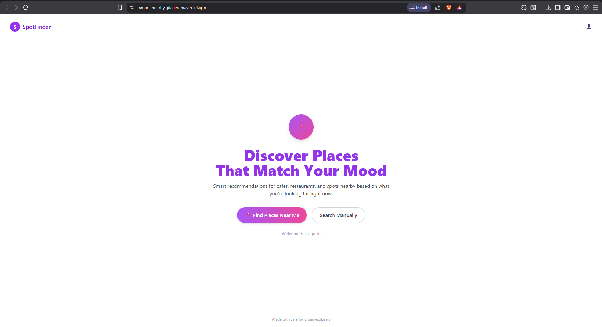
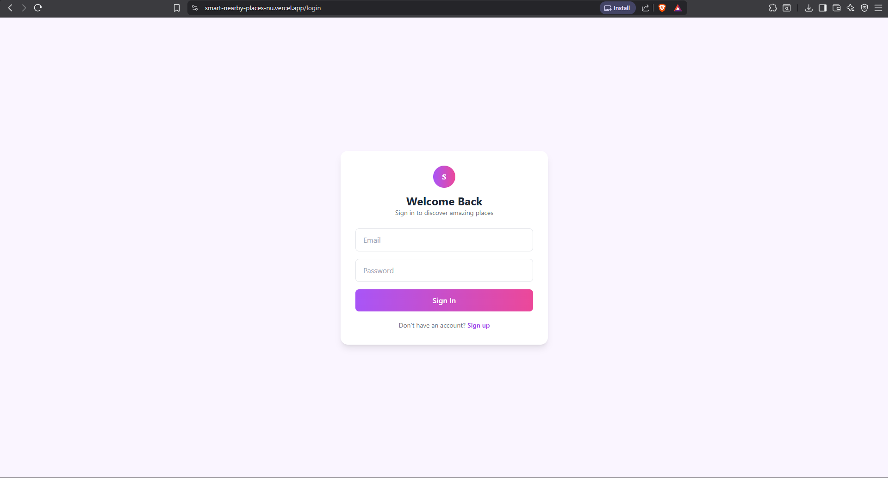
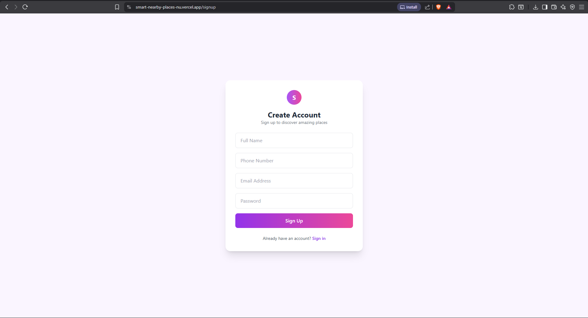
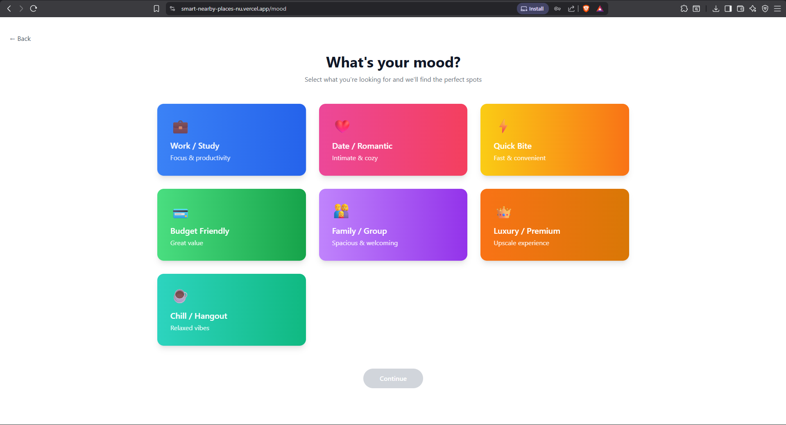
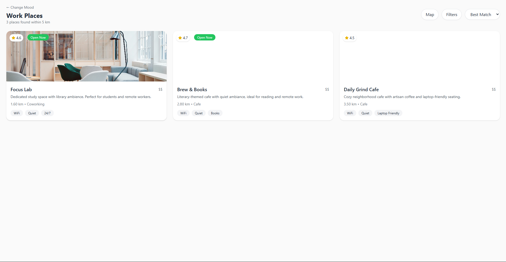
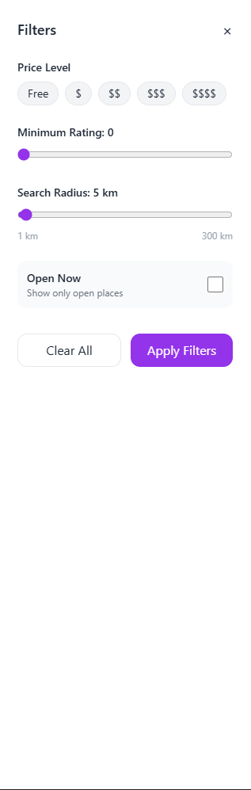
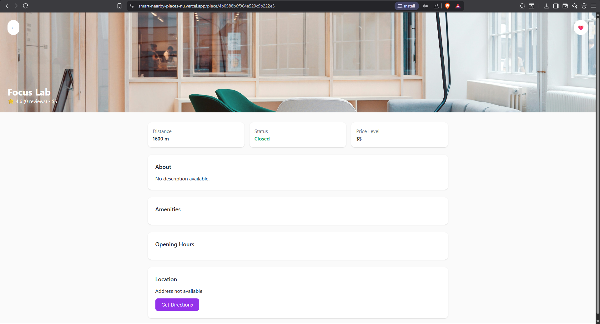

# Project Screenshots

This folder contains UI screenshots of the **Smart Nearby Places (SpotFinder)** application.

These images are used in the main `README.md` to visually demonstrate:
- User flow
- UI design
- Core features
- Application functionality

## Included Screens

- Home page
- Login page
- Signup page
- Mood selection screen
- Results list view
- Filters panel
- Place details page

All screenshots represent the live deployed version of the application.

## 📸 Screenshots

### Home

### Login

### Signup

### Mood Selection

### Results List

### Filters

### Place Details

